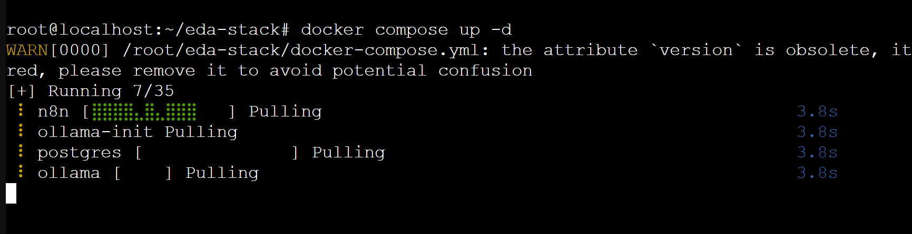
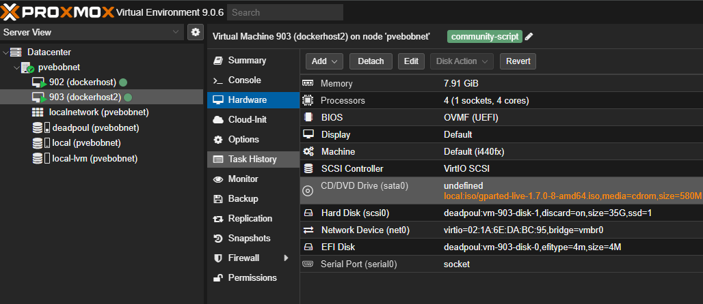
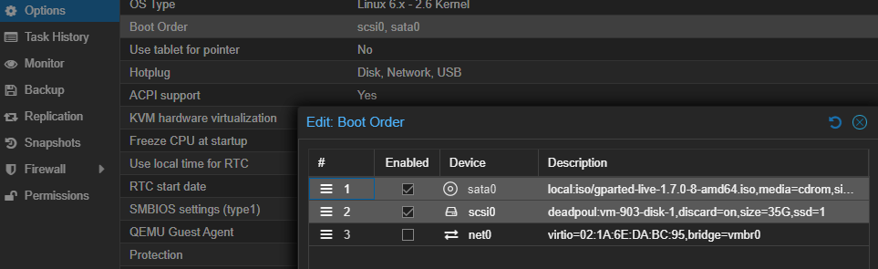
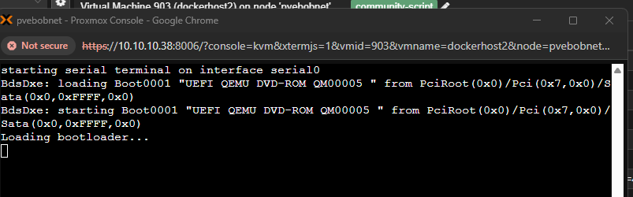
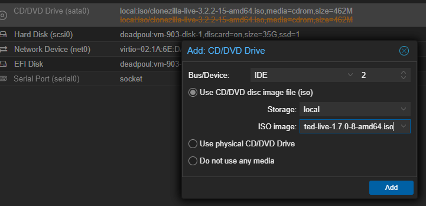
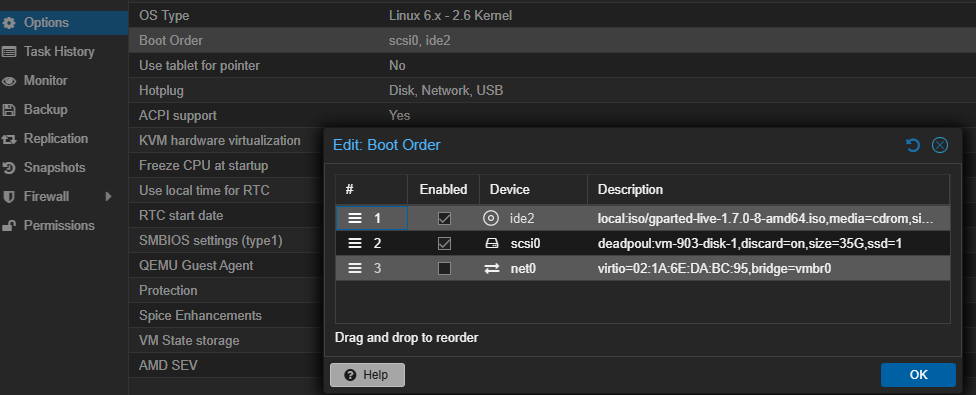
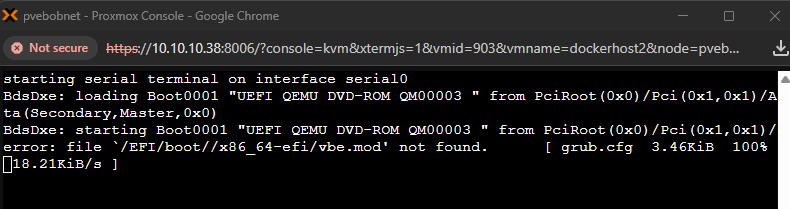

# dockerhost
docker host vm on proxmox


This is how I installed it.


1. install proxmox host

2. open ssh console and run script to deploy OS using selected PVE helper script. 

Example:
 
   [ Docker on Debian 12](https://community-scripts.github.io/ProxmoxVE/scripts?id=docker-vm)

   ```
   bash -c "$(curl -fsSL https://raw.githubusercontent.com/community-scripts/ProxmoxVE/main/vm/docker-vm.sh)"
   ```


3. deploy an application like ollama with gemma llm

Deploy ollama
```
docker run --cpus=4 -d -v ollama:/root/.ollama -p 11434:11434 --name ollama ollama/ollama
```
Deploy gemma 3:1b

```
docker exec -it ollama ollama run gemma3:1b/.olla

```
   
[reference on how to use ollama](https://ollama.com/blog/ollama-is-now-available-as-an-official-docker-image)


## Alternative configuration

1. deploy [debian 13 using pve scripts](https://community-scripts.github.io/ProxmoxVE/scripts?id=debian-13-vm&category=Operating+Systems)
```bash
bash -c "$(curl -fsSL https://raw.githubusercontent.com/community-scripts/ProxmoxVE/main/vm/debian-13-vm.sh)"
```


2.  connect to the new vm ssh or serial

3. install official docker from docker repo.
Because of this, please first uninstall all docker that was included from Debian. you want to use only docker.com as the source.
The unofficial packages to uninstall are:

* docker.io
* docker-compose
* docker-doc
* podman-docker

```bash
 for pkg in docker.io docker-doc docker-compose podman-docker containerd runc; do sudo apt-get remove $pkg; done

```

 Official Docker is comprosed of [Docker Engine](https://docs.docker.com/engine/install/debian/) and [Docker Compose](https://docs.docker.com/compose/install/linux/#install-the-plugin-manually). 


 Consequently, we need to add Docker's GPG key for the official Docker APT repository  

4. add GPG key

``` bash
# Add Docker's official GPG key:
sudo apt-get update
sudo apt-get install ca-certificates curl
sudo install -m 0755 -d /etc/apt/keyrings
sudo curl -fsSL https://download.docker.com/linux/debian/gpg -o /etc/apt/keyrings/docker.asc
sudo chmod a+r /etc/apt/keyrings/docker.asc

# Add the repository to Apt sources:
echo \
  "deb [arch=$(dpkg --print-architecture) signed-by=/etc/apt/keyrings/docker.asc] https://download.docker.com/linux/debian \
  $(. /etc/os-release && echo "$VERSION_CODENAME") stable" | \
  sudo tee /etc/apt/sources.list.d/docker.list > /dev/null
sudo apt-get update
``` 


5. install the lastest docker

```bash
sudo apt-get install docker-ce docker-ce-cli containerd.io docker-buildx-plugin docker-compose-plugin
```

6. test to make sure docker works
```bash
sudo docker run hello-world
```


7. use a docker compose file to build your aislop generated docket stack.

prepare project
```bash
mkdir eda-stack && cd eda-stack
```

Create docker-compose.yml using the file provided below 


[./docker-compose.yml](./docker-compose.yml)

launch
```
docker compose  up -d

```


ugg space


mount gparted


boot to cd

why wont it boot?



try ide this time




fail #2



trying to reboot gparted and expand

