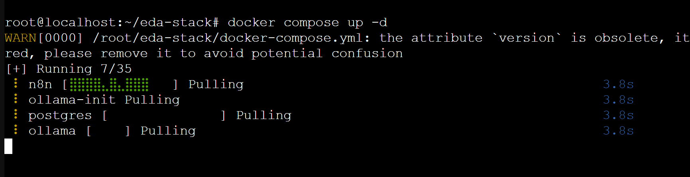
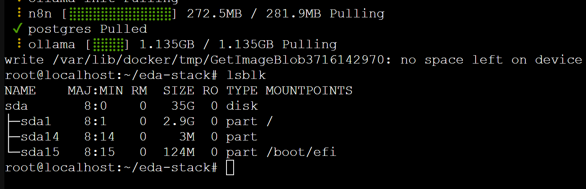
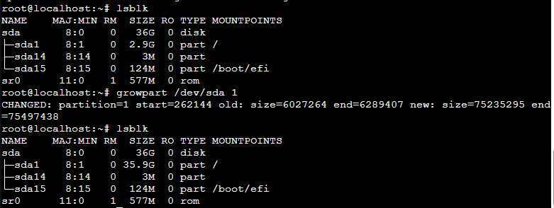
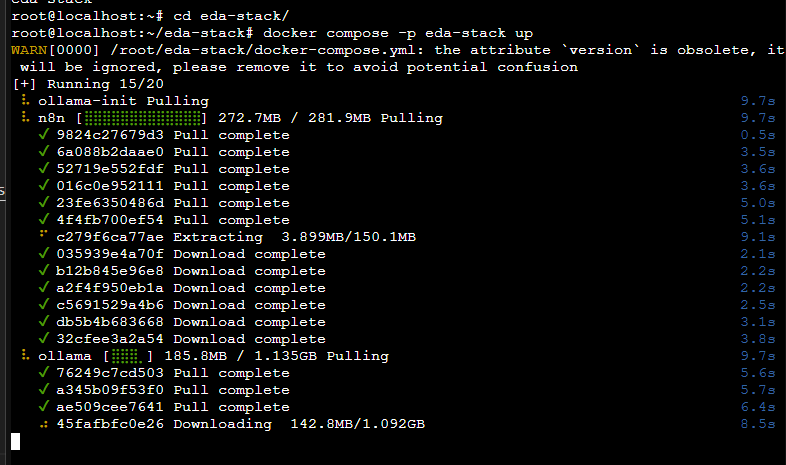
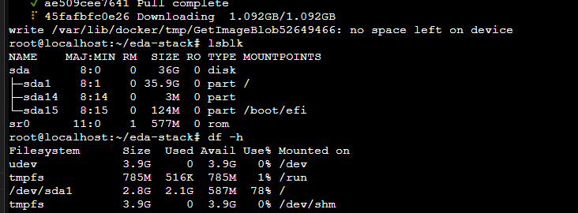
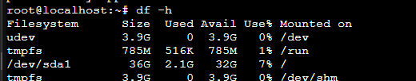
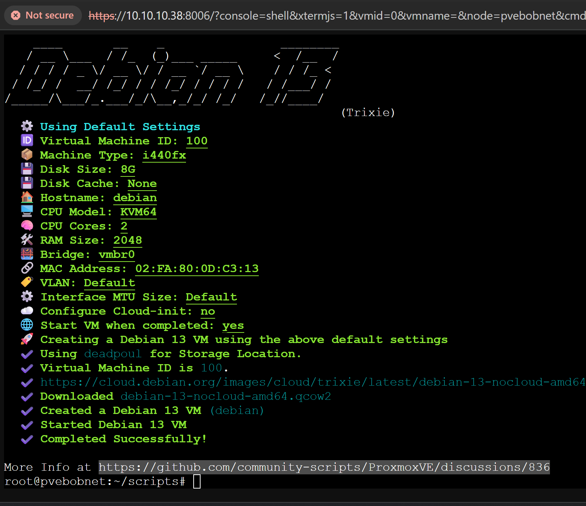
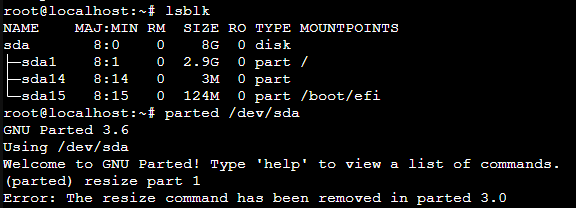
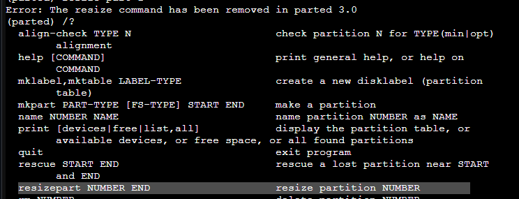
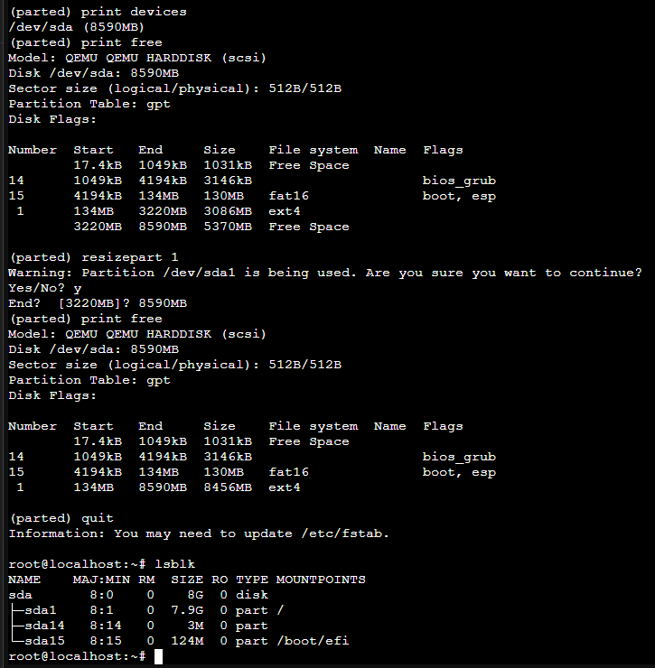

all my cool troubleshooting steps

```
docker compose  up -d

```


ugg  out of space on sda1?



get the [growpart tools](https://packages.debian.org/sid/cloud-guest-utils) 
```bash
apt update && apt install -y cloud-guest-utils
```

run growpart on part 1
```bash
sudo growpart /dev/sda 1
```


docker up


still doesnt see the storage. lets try reboot


reboot

much better


again - docker up.


It was pointed out to me that I missed the [obvious documentation.](
https://github.com/community-scripts/ProxmoxVE/discussions/836) 


however, those are notes for debian 12... and they do not help with the specific issue that I experienced.



yea, my way was easier. otherwise I would have to do math or something.

but fine, we will use the new commands that we will determine by trial and error instead of a one shot command like "growpart".

```bash
# you gotta do these line by line, interactivly.
parted

#this tells you the total size you are working with
print devices

#this tells you the partitions and each size. notice the chunk of free space at the end
print free

#ok now we resize.

resizepart 1
y
8590MB

print free
#YAY

quit

lsblk
#YASSS

```


So anyway, where were we?

